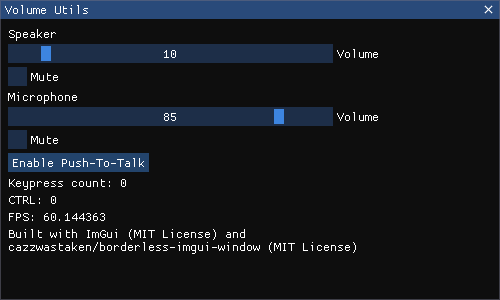

# Microphone utilites for windows

This repository contains utilities to control the speaker and microphone volume of the default device on the Windows operating system.
Feel free to use or modify the code, as it is mostly made to learn using the windows API.

## How to use
You can use the volume controls like this:

```C++
#include "audio_volume.hpp"
audio_volume microphone(audio_device_type::microphone);
microphone.mute(false);
microphone.set_volume(0.5f);
```

## Build example app
The example app uses [ImGui](https://github.com/ocornut/imgui) and [borderless ImGui window](https://github.com/cazzwastaken/borderless-imgui-window) to create a UI that controls the volume and mute status of the default speaker and default microphone.
It also installs a keyboard hook using the windows api to enable a push-to-talk functionality.



To build the app, add BUILD_VOLUME_UTILS_APP=ON to your call to cmake:
```
cmake -DBUILD_VOLUME_UTILS_APP=ON <path to src>
cmake --build .  --config Release
```
CMake will use fetchcontent to load the dependencies from github.
If everything works, a dll and the executable "volume_utils.exe" are in the build folder. Start the program with the usual double click and try it!

## License
All code in this repository is licensed using the Zero-Clause BSD license, see file "LICENSE".
